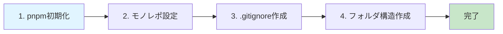
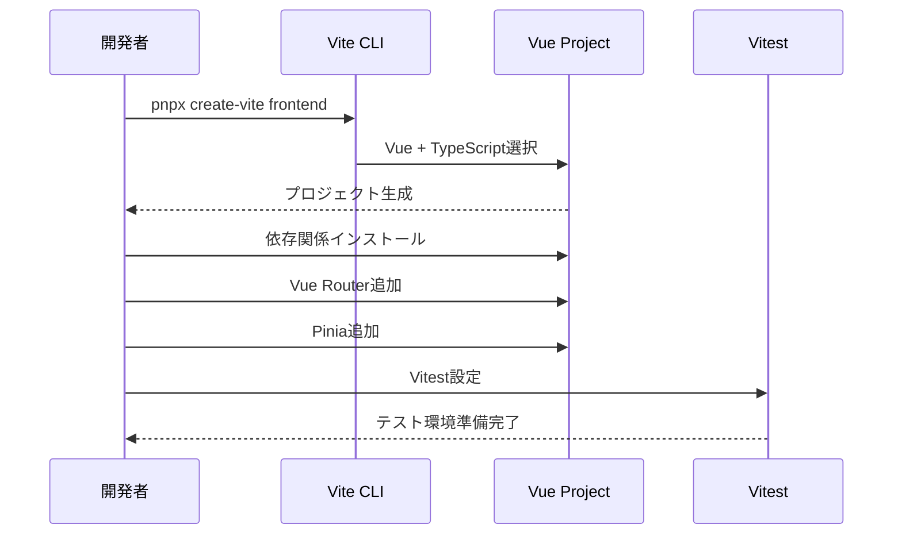
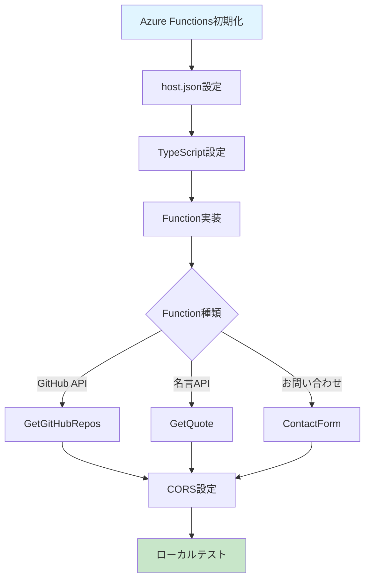
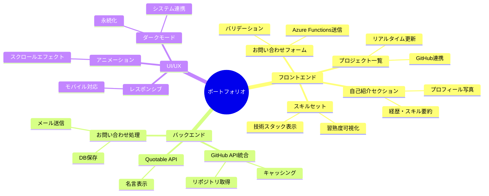
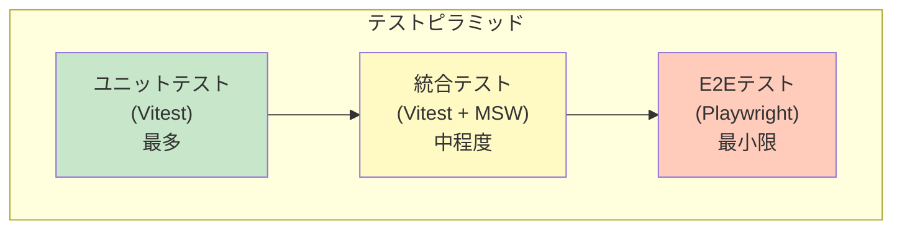
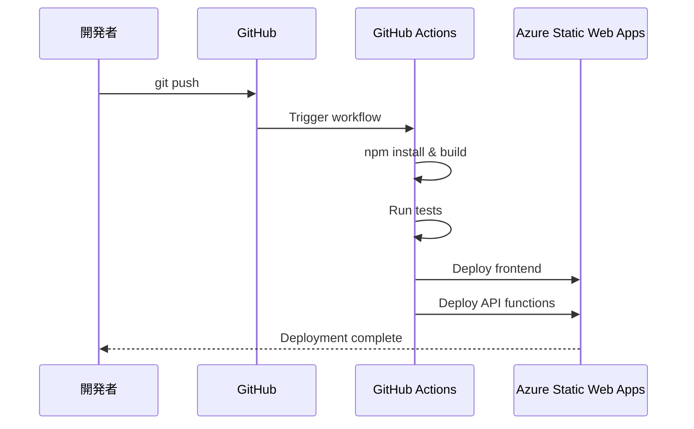

# 🚀 Vue.js + Azure Functions 就活用技術ポートフォリオ 構築手順書

> **技術スタック**: Windows + pnpm + TypeScript + Vue.js 3 + Azure Functions  
> **更新日**: 2026年1月7日

## 📋 目次

- [プロジェクト概要](#プロジェクト概要)
- [全体アーキテクチャ](#全体アーキテクチャ)
- [前提条件](#前提条件)
- [構築手順](#構築手順)
- [実装する機能](#実装する機能)
- [テスト戦略](#テスト戦略)
- [デプロイ手順](#デプロイ手順)
- [トラブルシューティング](#トラブルシューティング)

---

## 🎯 プロジェクト概要

このポートフォリオサイトは、モダンなフルスタック技術を用いた就職活動向けの技術デモンストレーションです。

### 主要な特徴

- ✅ **モノレポ構成**: pnpm workspacesで統合管理
- ✅ **TypeScript完全対応**: 型安全な開発環境
- ✅ **ダークモード対応**: システムpreference自動検出 + localStorage永続化
- ✅ **外部API統合**: GitHub API（リポジトリ表示）、Quotable API（名言表示）
- ✅ **サーバーレスAPI**: Azure Functionsでバックエンド処理
- ✅ **テスト実装**: Vitest + @vue/test-utils（pytestライクな体験）
- ✅ **CI/CD**: GitHub Actions自動デプロイ

---

## 🏗️ 全体アーキテクチャ

```mermaid
graph TB
    subgraph "Frontend - Vue.js"
        A[Vue 3 + TypeScript + Vite]
        B[Vue Router]
        C[Pinia 状態管理]
        D[ダークモードComposable]
        E[UIコンポーネント]
    end
    
    subgraph "Backend - Azure Functions"
        F[HTTP Trigger Functions]
        G[外部API統合]
        H[CORS設定]
    end
    
    subgraph "External APIs"
        I[GitHub REST API]
        J[Quotable API]
        K[JSONPlaceholder]
    end
    
    subgraph "Testing & Quality"
        L[Vitest]
        M[ESLint]
        N[@vue/test-utils]
    end
    
    subgraph "Deployment"
        O[Azure Static Web Apps]
        P[GitHub Actions CI/CD]
    end
    
    A --> B
    A --> C
    A --> D
    A --> E
    E --> F
    F --> G
    G --> I
    G --> J
    G --> K
    L --> N
    L --> E
    M --> A
    P --> O
    
    style A fill:#42b883
    style F fill:#0089d6
    style O fill:#0089d6
    style L fill:#fcc72b
```

### プロジェクト構造

```
vue-recruit-portfolio/
├── frontend/                    # Vue.jsフロントエンド
│   ├── src/
│   │   ├── assets/             # 静的アセット
│   │   ├── components/         # Vueコンポーネント
│   │   │   ├── __tests__/     # コンポーネントテスト
│   │   │   ├── common/        # 共通コンポーネント
│   │   │   ├── sections/      # セクションコンポーネント
│   │   │   └── layout/        # レイアウトコンポーネント
│   │   ├── composables/       # Vue Composables
│   │   │   └── useDarkMode.ts # ダークモード管理
│   │   ├── stores/            # Pinia stores
│   │   ├── router/            # Vue Router設定
│   │   ├── views/             # ページビュー
│   │   ├── styles/            # グローバルスタイル
│   │   │   └── variables.css  # CSS変数
│   │   ├── types/             # TypeScript型定義
│   │   ├── utils/             # ユーティリティ関数
│   │   ├── App.vue
│   │   └── main.ts
│   ├── public/
│   ├── index.html
│   ├── package.json
│   ├── tsconfig.json
│   ├── vite.config.ts
│   └── vitest.config.ts
│
├── api/                        # Azure Functions API
│   ├── src/
│   │   ├── functions/         # Function実装
│   │   │   ├── GetGitHubRepos.ts
│   │   │   ├── GetQuote.ts
│   │   │   └── ContactForm.ts
│   │   ├── utils/             # 共通ユーティリティ
│   │   └── types/             # TypeScript型定義
│   ├── host.json
│   ├── local.settings.json
│   ├── package.json
│   └── tsconfig.json
│
├── .github/
│   └── workflows/
│       └── azure-static-web-apps.yml
├── pnpm-workspace.yaml
├── package.json               # ルートpackage.json
├── .gitignore
├── .env.example
├── README.md
└── 00_HOW_TO.md              # この手順書
```

---

## 📦 前提条件

### 必須ソフトウェア

| ソフトウェア | バージョン | インストール方法 |
|------------|----------|----------------|
| **Node.js** | v18以上 | [https://nodejs.org/](https://nodejs.org/) |
| **pnpm** | 最新版 | `npm install -g pnpm` |
| **Azure Functions Core Tools** | v4 | `npm install -g azure-functions-core-tools@4` |
| **Git** | 最新版 | [https://git-scm.com/](https://git-scm.com/) |

### 推奨VSCode拡張機能

```json
{
  "recommendations": [
    "vue.volar",
    "ms-azuretools.vscode-azurefunctions",
    "dbaeumer.vscode-eslint",
    "esbenp.prettier-vscode",
    "vitest.explorer"
  ]
}
```

### アカウント・サービス

- ✅ GitHub アカウント
- ✅ Azure アカウント（無料枠で十分）
- ✅ OpenWeatherMap API Key（オプション）

---

## 🔧 構築手順

### フェーズ1: プロジェクト初期化



#### 1-1. ルートpackage.json作成

```bash
cd d:\plumiume\Workspace\1plumiume@github\vue-recruit-portfolio
pnpm init
```

**package.json** を編集:

```json
{
  "name": "vue-recruit-portfolio",
  "version": "1.0.0",
  "description": "Technical Portfolio with Vue.js and Azure Functions",
  "private": true,
  "scripts": {
    "dev": "pnpm --parallel -r dev",
    "build": "pnpm -r build",
    "test": "pnpm -r test",
    "lint": "pnpm -r lint"
  },
  "keywords": ["vue", "azure-functions", "portfolio", "typescript"],
  "author": "Your Name",
  "license": "MIT"
}
```

#### 1-2. pnpm workspaces設定

**pnpm-workspace.yaml** を作成:

```yaml
packages:
  - 'frontend'
  - 'api'
```

#### 1-3. .gitignore作成

```gitignore
# Dependencies
node_modules/
.pnpm-store/

# Build outputs
dist/
build/
.output/

# Environment variables
.env
.env.local
local.settings.json

# IDE
.vscode/*
!.vscode/extensions.json
.idea/
*.swp
*.swo

# OS
.DS_Store
Thumbs.db

# Azure Functions
api/bin/
api/obj/

# Logs
*.log
npm-debug.log*
pnpm-debug.log*

# Testing
coverage/
.nyc_output/
```

---

### フェーズ2: Vueフロントエンド構築



#### 2-1. Viteプロジェクト作成

```bash
# 対話式でプロジェクト作成
pnpx create-vite frontend
# プロンプトで以下を選択:
# ? Select a framework: › Vue
# ? Select a variant: › TypeScript

cd frontend
pnpm install
```

#### 2-2. 必要な依存関係を追加

```bash
# ルーティング & 状態管理
pnpm add vue-router@4 pinia

# テスト関連
pnpm add -D vitest @vue/test-utils jsdom @vitest/ui

# Linting & Formatting
pnpm add -D eslint @typescript-eslint/eslint-plugin @typescript-eslint/parser
pnpm add -D prettier eslint-config-prettier eslint-plugin-vue

# ユーティリティ
pnpm add axios
```

#### 2-3. Vite設定（vite.config.ts）

```typescript
import { defineConfig } from 'vite'
import vue from '@vitejs/plugin-vue'
import path from 'path'

export default defineConfig({
  plugins: [vue()],
  resolve: {
    alias: {
      '@': path.resolve(__dirname, './src')
    }
  },
  server: {
    port: 3000,
    proxy: {
      '/api': {
        target: 'http://localhost:7071',
        changeOrigin: true
      }
    }
  }
})
```

#### 2-4. Vitest設定（vitest.config.ts）

```typescript
import { defineConfig } from 'vitest/config'
import vue from '@vitejs/plugin-vue'
import path from 'path'

export default defineConfig({
  plugins: [vue()],
  test: {
    globals: true,
    environment: 'jsdom',
    coverage: {
      provider: 'v8',
      reporter: ['text', 'json', 'html'],
      exclude: ['node_modules/', 'src/__tests__/']
    }
  },
  resolve: {
    alias: {
      '@': path.resolve(__dirname, './src')
    }
  }
})
```

#### 2-5. TypeScript設定（tsconfig.json）

```json
{
  "compilerOptions": {
    "target": "ES2020",
    "useDefineForClassFields": true,
    "module": "ESNext",
    "lib": ["ES2020", "DOM", "DOM.Iterable"],
    "skipLibCheck": true,
    "moduleResolution": "bundler",
    "allowImportingTsExtensions": true,
    "resolveJsonModule": true,
    "isolatedModules": true,
    "noEmit": true,
    "jsx": "preserve",
    "strict": true,
    "noUnusedLocals": true,
    "noUnusedParameters": true,
    "noFallthroughCasesInSwitch": true,
    "baseUrl": ".",
    "paths": {
      "@/*": ["./src/*"]
    }
  },
  "include": ["src/**/*.ts", "src/**/*.d.ts", "src/**/*.tsx", "src/**/*.vue"],
  "references": [{ "path": "./tsconfig.node.json" }]
}
```

#### 2-6. package.jsonスクリプト更新

```json
{
  "scripts": {
    "dev": "vite",
    "build": "vue-tsc && vite build",
    "preview": "vite preview",
    "test": "vitest",
    "test:ui": "vitest --ui",
    "coverage": "vitest run --coverage",
    "lint": "eslint . --ext .vue,.js,.jsx,.cjs,.mjs,.ts,.tsx,.cts,.mts --fix"
  }
}
```

---

### フェーズ3: ダークモード実装

#### 3-1. CSS変数定義（src/styles/variables.css）

```css
:root {
  /* Light Mode */
  --bg-primary: #ffffff;
  --bg-secondary: #f5f5f5;
  --bg-tertiary: #e0e0e0;
  
  --text-primary: #1a1a1a;
  --text-secondary: #4a4a4a;
  --text-tertiary: #8a8a8a;
  
  --accent-primary: #3b82f6;
  --accent-secondary: #2563eb;
  --accent-hover: #1d4ed8;
  
  --border-color: #d1d5db;
  --shadow-color: rgba(0, 0, 0, 0.1);
  
  --success: #10b981;
  --warning: #f59e0b;
  --error: #ef4444;
  
  --transition-speed: 0.3s;
}

:root.dark {
  /* Dark Mode */
  --bg-primary: #0f172a;
  --bg-secondary: #1e293b;
  --bg-tertiary: #334155;
  
  --text-primary: #f1f5f9;
  --text-secondary: #cbd5e1;
  --text-tertiary: #94a3b8;
  
  --accent-primary: #60a5fa;
  --accent-secondary: #3b82f6;
  --accent-hover: #2563eb;
  
  --border-color: #475569;
  --shadow-color: rgba(0, 0, 0, 0.3);
  
  --success: #34d399;
  --warning: #fbbf24;
  --error: #f87171;
}

* {
  transition: background-color var(--transition-speed) ease,
              color var(--transition-speed) ease,
              border-color var(--transition-speed) ease;
}

body {
  background-color: var(--bg-primary);
  color: var(--text-primary);
}
```

#### 3-2. ダークモードComposable（src/composables/useDarkMode.ts）

```typescript
import { ref, onMounted, watch } from 'vue'

const isDark = ref(false)

export const useDarkMode = () => {
  const toggleDark = () => {
    isDark.value = !isDark.value
  }

  const setDark = (value: boolean) => {
    isDark.value = value
  }

  const updateTheme = () => {
    if (isDark.value) {
      document.documentElement.classList.add('dark')
      localStorage.setItem('theme', 'dark')
    } else {
      document.documentElement.classList.remove('dark')
      localStorage.setItem('theme', 'light')
    }
  }

  const initTheme = () => {
    const savedTheme = localStorage.getItem('theme')
    const prefersDark = window.matchMedia('(prefers-color-scheme: dark)').matches
    
    if (savedTheme === 'dark' || (!savedTheme && prefersDark)) {
      isDark.value = true
    } else {
      isDark.value = false
    }
    
    updateTheme()
  }

  // テーマ変更を監視
  watch(isDark, updateTheme)

  onMounted(() => {
    initTheme()
    
    // システムpreference変更を監視
    const mediaQuery = window.matchMedia('(prefers-color-scheme: dark)')
    const handleChange = (e: MediaQueryListEvent) => {
      if (!localStorage.getItem('theme')) {
        isDark.value = e.matches
      }
    }
    
    mediaQuery.addEventListener('change', handleChange)
    
    // クリーンアップは onUnmounted で
  })

  return {
    isDark,
    toggleDark,
    setDark
  }
}
```

#### 3-3. テスト作成（src/composables/__tests__/useDarkMode.spec.ts）

```typescript
import { describe, it, expect, beforeEach, vi } from 'vitest'
import { useDarkMode } from '../useDarkMode'

describe('useDarkMode', () => {
  beforeEach(() => {
    localStorage.clear()
    document.documentElement.classList.remove('dark')
  })

  it('should toggle dark mode', () => {
    const { isDark, toggleDark } = useDarkMode()
    
    expect(isDark.value).toBe(false)
    toggleDark()
    expect(isDark.value).toBe(true)
    expect(document.documentElement.classList.contains('dark')).toBe(true)
  })

  it('should persist theme in localStorage', () => {
    const { toggleDark } = useDarkMode()
    
    toggleDark()
    expect(localStorage.getItem('theme')).toBe('dark')
  })

  it('should respect system preference', () => {
    const matchMediaMock = vi.fn().mockImplementation((query) => ({
      matches: query === '(prefers-color-scheme: dark)',
      addEventListener: vi.fn(),
      removeEventListener: vi.fn()
    }))
    
    Object.defineProperty(window, 'matchMedia', {
      writable: true,
      value: matchMediaMock
    })

    const { isDark } = useDarkMode()
    expect(isDark.value).toBe(true)
  })
})
```

---

### フェーズ4: Azure Functions API構築



#### 4-1. Azure Functions初期化

```bash
cd ..
mkdir api
cd api
func init . --typescript --worker-runtime node
pnpm install
```

#### 4-2. 必要な依存関係を追加

```bash
pnpm add @azure/functions axios
pnpm add -D @types/node typescript
```

#### 4-3. host.json設定

```json
{
  "version": "2.0",
  "logging": {
    "applicationInsights": {
      "samplingSettings": {
        "isEnabled": true,
        "maxTelemetryItemsPerSecond": 20
      }
    }
  },
  "extensionBundle": {
    "id": "Microsoft.Azure.Functions.ExtensionBundle",
    "version": "[4.*, 5.0.0)"
  }
}
```

#### 4-4. local.settings.json設定

```json
{
  "IsEncrypted": false,
  "Values": {
    "AzureWebJobsStorage": "",
    "FUNCTIONS_WORKER_RUNTIME": "node",
    "GITHUB_USERNAME": "your-github-username",
    "CORS_ALLOWED_ORIGINS": "http://localhost:3000"
  },
  "Host": {
    "CORS": "http://localhost:3000",
    "CORSCredentials": false
  }
}
```

#### 4-5. Function実装例

**src/functions/GetGitHubRepos.ts**

```typescript
import { app, HttpRequest, HttpResponseInit, InvocationContext } from '@azure/functions'
import axios from 'axios'

interface GitHubRepo {
  id: number
  name: string
  description: string | null
  html_url: string
  stargazers_count: number
  language: string | null
  updated_at: string
}

export async function GetGitHubRepos(
  request: HttpRequest,
  context: InvocationContext
): Promise<HttpResponseInit> {
  context.log('GetGitHubRepos function triggered')

  try {
    const username = process.env.GITHUB_USERNAME || 'octocat'
    const response = await axios.get<GitHubRepo[]>(
      `https://api.github.com/users/${username}/repos`,
      {
        params: {
          sort: 'updated',
          per_page: 10
        },
        headers: {
          'Accept': 'application/vnd.github.v3+json'
        }
      }
    )

    const repos = response.data.map(repo => ({
      id: repo.id,
      name: repo.name,
      description: repo.description,
      url: repo.html_url,
      stars: repo.stargazers_count,
      language: repo.language,
      updatedAt: repo.updated_at
    }))

    return {
      status: 200,
      jsonBody: {
        success: true,
        data: repos
      }
    }
  } catch (error) {
    context.error('Error fetching GitHub repos:', error)
    
    return {
      status: 500,
      jsonBody: {
        success: false,
        error: 'Failed to fetch GitHub repositories'
      }
    }
  }
}

app.http('GetGitHubRepos', {
  methods: ['GET'],
  authLevel: 'anonymous',
  handler: GetGitHubRepos
})
```

**src/functions/GetQuote.ts**

```typescript
import { app, HttpRequest, HttpResponseInit, InvocationContext } from '@azure/functions'
import axios from 'axios'

interface Quote {
  _id: string
  content: string
  author: string
  tags: string[]
}

export async function GetQuote(
  request: HttpRequest,
  context: InvocationContext
): Promise<HttpResponseInit> {
  context.log('GetQuote function triggered')

  try {
    const response = await axios.get<Quote>('https://api.quotable.io/random')

    return {
      status: 200,
      jsonBody: {
        success: true,
        data: {
          quote: response.data.content,
          author: response.data.author,
          tags: response.data.tags
        }
      }
    }
  } catch (error) {
    context.error('Error fetching quote:', error)
    
    return {
      status: 500,
      jsonBody: {
        success: false,
        error: 'Failed to fetch quote'
      }
    }
  }
}

app.http('GetQuote', {
  methods: ['GET'],
  authLevel: 'anonymous',
  handler: GetQuote
})
```

**src/functions/ContactForm.ts**

```typescript
import { app, HttpRequest, HttpResponseInit, InvocationContext } from '@azure/functions'

interface ContactFormData {
  name: string
  email: string
  message: string
}

export async function ContactForm(
  request: HttpRequest,
  context: InvocationContext
): Promise<HttpResponseInit> {
  context.log('ContactForm function triggered')

  try {
    const body = await request.json() as ContactFormData

    // バリデーション
    if (!body.name || !body.email || !body.message) {
      return {
        status: 400,
        jsonBody: {
          success: false,
          error: 'All fields are required'
        }
      }
    }

    // 本番環境ではここでメール送信やDB保存を実装
    context.log('Contact form submission:', {
      name: body.name,
      email: body.email,
      messageLength: body.message.length
    })

    return {
      status: 200,
      jsonBody: {
        success: true,
        message: 'Contact form submitted successfully'
      }
    }
  } catch (error) {
    context.error('Error processing contact form:', error)
    
    return {
      status: 500,
      jsonBody: {
        success: false,
        error: 'Failed to process contact form'
      }
    }
  }
}

app.http('ContactForm', {
  methods: ['POST'],
  authLevel: 'anonymous',
  handler: ContactForm
})
```

#### 4-6. package.jsonスクリプト更新

```json
{
  "scripts": {
    "build": "tsc",
    "watch": "tsc --watch",
    "clean": "rimraf dist",
    "prestart": "npm run clean && npm run build",
    "dev": "func start",
    "start": "func start"
  }
}
```

---

### フェーズ5: ポートフォリオコンテンツ実装

#### 5-1. Vue Router設定（src/router/index.ts）

```typescript
import { createRouter, createWebHistory, RouteRecordRaw } from 'vue-router'
import Home from '@/views/Home.vue'

const routes: RouteRecordRaw[] = [
  {
    path: '/',
    name: 'Home',
    component: Home
  },
  {
    path: '/projects',
    name: 'Projects',
    component: () => import('@/views/Projects.vue')
  },
  {
    path: '/skills',
    name: 'Skills',
    component: () => import('@/views/Skills.vue')
  },
  {
    path: '/contact',
    name: 'Contact',
    component: () => import('@/views/Contact.vue')
  }
]

const router = createRouter({
  history: createWebHistory(),
  routes
})

export default router
```

#### 5-2. Pinia Store（src/stores/portfolio.ts）

```typescript
import { defineStore } from 'pinia'
import { ref } from 'vue'
import axios from 'axios'

interface Repository {
  id: number
  name: string
  description: string | null
  url: string
  stars: number
  language: string | null
  updatedAt: string
}

interface Quote {
  quote: string
  author: string
  tags: string[]
}

export const usePortfolioStore = defineStore('portfolio', () => {
  const repositories = ref<Repository[]>([])
  const quote = ref<Quote | null>(null)
  const loading = ref(false)
  const error = ref<string | null>(null)

  const fetchRepositories = async () => {
    loading.value = true
    error.value = null
    
    try {
      const response = await axios.get('/api/GetGitHubRepos')
      repositories.value = response.data.data
    } catch (err) {
      error.value = 'Failed to fetch repositories'
      console.error(err)
    } finally {
      loading.value = false
    }
  }

  const fetchQuote = async () => {
    try {
      const response = await axios.get('/api/GetQuote')
      quote.value = response.data.data
    } catch (err) {
      console.error('Failed to fetch quote:', err)
    }
  }

  const submitContactForm = async (data: {
    name: string
    email: string
    message: string
  }) => {
    loading.value = true
    error.value = null
    
    try {
      await axios.post('/api/ContactForm', data)
      return true
    } catch (err) {
      error.value = 'Failed to submit contact form'
      console.error(err)
      return false
    } finally {
      loading.value = false
    }
  }

  return {
    repositories,
    quote,
    loading,
    error,
    fetchRepositories,
    fetchQuote,
    submitContactForm
  }
})
```

#### 5-3. コンポーネント例（src/components/sections/ProjectsSection.vue）

```vue
<script setup lang="ts">
import { onMounted } from 'vue'
import { usePortfolioStore } from '@/stores/portfolio'

const store = usePortfolioStore()

onMounted(() => {
  store.fetchRepositories()
})
</script>

<template>
  <section class="projects-section">
    <h2>My Projects</h2>
    
    <div v-if="store.loading" class="loading">
      Loading projects...
    </div>
    
    <div v-else-if="store.error" class="error">
      {{ store.error }}
    </div>
    
    <div v-else class="projects-grid">
      <article
        v-for="repo in store.repositories"
        :key="repo.id"
        class="project-card"
      >
        <h3>{{ repo.name }}</h3>
        <p>{{ repo.description || 'No description available' }}</p>
        
        <div class="project-meta">
          <span v-if="repo.language" class="language">{{ repo.language }}</span>
          <span class="stars">⭐ {{ repo.stars }}</span>
        </div>
        
        <a :href="repo.url" target="_blank" rel="noopener noreferrer">
          View on GitHub →
        </a>
      </article>
    </div>
  </section>
</template>

<style scoped>
.projects-section {
  padding: 4rem 2rem;
  max-width: 1200px;
  margin: 0 auto;
}

h2 {
  font-size: 2.5rem;
  margin-bottom: 2rem;
  text-align: center;
}

.projects-grid {
  display: grid;
  grid-template-columns: repeat(auto-fill, minmax(300px, 1fr));
  gap: 2rem;
}

.project-card {
  background: var(--bg-secondary);
  border: 1px solid var(--border-color);
  border-radius: 8px;
  padding: 1.5rem;
  transition: transform 0.2s ease, box-shadow 0.2s ease;
}

.project-card:hover {
  transform: translateY(-4px);
  box-shadow: 0 8px 16px var(--shadow-color);
}

.project-card h3 {
  color: var(--accent-primary);
  margin-bottom: 0.5rem;
}

.project-meta {
  display: flex;
  gap: 1rem;
  margin: 1rem 0;
  font-size: 0.875rem;
  color: var(--text-secondary);
}

.loading,
.error {
  text-align: center;
  padding: 2rem;
  font-size: 1.25rem;
}

.error {
  color: var(--error);
}
</style>
```

---

### フェーズ6: テスト実装

#### 6-1. コンポーネントテスト例

**src/components/sections/__tests__/ProjectsSection.spec.ts**

```typescript
import { describe, it, expect, beforeEach, vi } from 'vitest'
import { mount } from '@vue/test-utils'
import { createPinia, setActivePinia } from 'pinia'
import ProjectsSection from '../ProjectsSection.vue'
import { usePortfolioStore } from '@/stores/portfolio'

describe('ProjectsSection.vue', () => {
  beforeEach(() => {
    setActivePinia(createPinia())
  })

  it('renders loading state', () => {
    const store = usePortfolioStore()
    store.loading = true

    const wrapper = mount(ProjectsSection)
    expect(wrapper.text()).toContain('Loading projects')
  })

  it('renders error state', () => {
    const store = usePortfolioStore()
    store.error = 'Failed to fetch repositories'

    const wrapper = mount(ProjectsSection)
    expect(wrapper.text()).toContain('Failed to fetch repositories')
  })

  it('renders projects list', () => {
    const store = usePortfolioStore()
    store.repositories = [
      {
        id: 1,
        name: 'Test Repo',
        description: 'A test repository',
        url: 'https://github.com/test/repo',
        stars: 10,
        language: 'TypeScript',
        updatedAt: '2026-01-01'
      }
    ]

    const wrapper = mount(ProjectsSection)
    expect(wrapper.text()).toContain('Test Repo')
    expect(wrapper.text()).toContain('A test repository')
    expect(wrapper.text()).toContain('TypeScript')
    expect(wrapper.text()).toContain('10')
  })

  it('calls fetchRepositories on mount', () => {
    const store = usePortfolioStore()
    const fetchSpy = vi.spyOn(store, 'fetchRepositories')

    mount(ProjectsSection)
    expect(fetchSpy).toHaveBeenCalledOnce()
  })
})
```

#### 6-2. Store テスト例

**src/stores/__tests__/portfolio.spec.ts**

```typescript
import { describe, it, expect, beforeEach, vi } from 'vitest'
import { setActivePinia, createPinia } from 'pinia'
import { usePortfolioStore } from '../portfolio'
import axios from 'axios'

vi.mock('axios')

describe('Portfolio Store', () => {
  beforeEach(() => {
    setActivePinia(createPinia())
    vi.clearAllMocks()
  })

  it('fetches repositories successfully', async () => {
    const mockRepos = {
      data: {
        data: [
          { id: 1, name: 'repo1', description: 'desc1', url: 'url1', stars: 5, language: 'JS', updatedAt: '2026-01-01' }
        ]
      }
    }
    
    vi.mocked(axios.get).mockResolvedValueOnce(mockRepos)

    const store = usePortfolioStore()
    await store.fetchRepositories()

    expect(store.repositories).toHaveLength(1)
    expect(store.repositories[0].name).toBe('repo1')
    expect(store.loading).toBe(false)
    expect(store.error).toBeNull()
  })

  it('handles fetch error', async () => {
    vi.mocked(axios.get).mockRejectedValueOnce(new Error('Network error'))

    const store = usePortfolioStore()
    await store.fetchRepositories()

    expect(store.repositories).toHaveLength(0)
    expect(store.error).toBe('Failed to fetch repositories')
    expect(store.loading).toBe(false)
  })
})
```

#### 6-3. テスト実行

```bash
# フロントエンドディレクトリで
pnpm test              # テスト実行
pnpm test:ui           # UIでテスト実行
pnpm coverage          # カバレッジレポート生成
```

---

## 🚀 実装する機能

### コア機能



### 機能優先度

| 優先度 | 機能 | 説明 | 実装難易度 |
|-------|------|------|----------|
| **必須** | ダークモード | システムpreference対応 | ⭐⭐ |
| **必須** | GitHub連携 | リポジトリ一覧表示 | ⭐⭐⭐ |
| **必須** | レスポンシブデザイン | モバイル・タブレット対応 | ⭐⭐ |
| **推奨** | お問い合わせフォーム | Azure Functions経由 | ⭐⭐⭐ |
| **推奨** | Vitestテスト | 主要コンポーネント | ⭐⭐⭐ |
| **推奨** | 名言表示 | Quotable API | ⭐ |
| **オプション** | アニメーション | スクロールエフェクト | ⭐⭐ |
| **オプション** | PWA化 | オフライン対応 | ⭐⭐⭐⭐ |
| **オプション** | 多言語対応 | i18n | ⭐⭐⭐ |

---

## 🧪 テスト戦略

### Vitest vs pytest 比較

| 機能 | pytest (Python) | Vitest (TypeScript/Vue) |
|------|----------------|------------------------|
| **テスト記述** | `def test_xxx():` | `it('should xxx', () => {})` |
| **グループ化** | `class TestXxx:` | `describe('Xxx', () => {})` |
| **アサーション** | `assert x == y` | `expect(x).toBe(y)` |
| **モック** | `unittest.mock` | `vi.mock()`, `vi.fn()` |
| **フィクスチャ** | `@pytest.fixture` | `beforeEach()`, `afterEach()` |
| **カバレッジ** | `pytest-cov` | `@vitest/coverage` |
| **実行速度** | 並列実行可 | Viteベースで超高速 |

### テストピラミッド



### テスト対象の優先度

1. **高優先度（必須）**:
   - ダークモード切替ロジック（`useDarkMode.ts`）
   - Pinia Stores（API呼び出し、状態管理）
   - フォームバリデーション

2. **中優先度（推奨）**:
   - 主要コンポーネント（ProjectsSection、ContactForm）
   - ルーティング
   - ユーティリティ関数

3. **低優先度（オプション）**:
   - UIコンポーネントの見た目
   - アニメーション
   - E2Eフロー

---

## 📦 デプロイ手順

### Azure Static Web Apps（推奨）



#### ステップ1: Azure Static Web Appsリソース作成

```bash
# Azure CLIでログイン
az login

# リソースグループ作成
az group create --name rg-portfolio --location japaneast

# Static Web App作成
az staticwebapp create \
  --name swa-portfolio \
  --resource-group rg-portfolio \
  --source https://github.com/YOUR_USERNAME/vue-recruit-portfolio \
  --location japaneast \
  --branch main \
  --app-location "/frontend" \
  --api-location "/api" \
  --output-location "dist"
```

#### ステップ2: GitHub Actions設定

**.github/workflows/azure-static-web-apps.yml**

```yaml
name: Azure Static Web Apps CI/CD

on:
  push:
    branches:
      - main
  pull_request:
    types: [opened, synchronize, reopened, closed]
    branches:
      - main

jobs:
  build_and_deploy_job:
    if: github.event_name == 'push' || (github.event_name == 'pull_request' && github.event.action != 'closed')
    runs-on: ubuntu-latest
    name: Build and Deploy Job
    steps:
      - uses: actions/checkout@v3
        with:
          submodules: true

      - name: Setup Node.js
        uses: actions/setup-node@v3
        with:
          node-version: '18'

      - name: Setup pnpm
        uses: pnpm/action-setup@v2
        with:
          version: 8

      - name: Install dependencies
        run: pnpm install

      - name: Run tests
        run: pnpm test --run
        working-directory: ./frontend

      - name: Build frontend
        run: pnpm build
        working-directory: ./frontend

      - name: Build API
        run: pnpm build
        working-directory: ./api

      - name: Deploy to Azure Static Web Apps
        uses: Azure/static-web-apps-deploy@v1
        with:
          azure_static_web_apps_api_token: ${{ secrets.AZURE_STATIC_WEB_APPS_API_TOKEN }}
          repo_token: ${{ secrets.GITHUB_TOKEN }}
          action: "upload"
          app_location: "/frontend"
          api_location: "/api"
          output_location: "dist"

  close_pull_request_job:
    if: github.event_name == 'pull_request' && github.event.action == 'closed'
    runs-on: ubuntu-latest
    name: Close Pull Request Job
    steps:
      - name: Close Pull Request
        uses: Azure/static-web-apps-deploy@v1
        with:
          azure_static_web_apps_api_token: ${{ secrets.AZURE_STATIC_WEB_APPS_API_TOKEN }}
          action: "close"
```

#### ステップ3: 環境変数設定

GitHubリポジトリの Settings > Secrets and variables > Actions で設定:

- `AZURE_STATIC_WEB_APPS_API_TOKEN`: Azureポータルからコピーしたデプロイトークン

---

## 🎓 学習ポイント（就活アピール用）

### 1. モダンな開発手法

- ✅ **モノレポ管理**: pnpm workspacesで複数プロジェクト統合管理
- ✅ **型安全性**: TypeScriptで品質向上
- ✅ **テスト駆動**: Vitestでpytestライクな開発体験

### 2. クラウドネイティブ

- ✅ **サーバーレス**: Azure Functionsでコスト最適化
- ✅ **CI/CD**: GitHub Actionsで自動デプロイ
- ✅ **スケーラビリティ**: Azure Static Web Appsの自動スケーリング

### 3. UXへの配慮

- ✅ **ダークモード**: システムpreference対応
- ✅ **レスポンシブ**: モバイルファースト設計
- ✅ **パフォーマンス**: Viteの高速ビルド

### 4. 実践的なAPI統合

- ✅ **REST API**: GitHub、Quotable等の外部サービス連携
- ✅ **エラーハンドリング**: 適切なエラー処理と通知
- ✅ **ローディング状態**: UXを考慮した非同期処理

---

## 🐛 トラブルシューティング

### よくある問題と解決策

#### 1. pnpmコマンドが見つからない

```bash
# pnpmをグローバルインストール
npm install -g pnpm

# パスが通っているか確認
pnpm --version
```

#### 2. Azure Functions がローカルで起動しない

```bash
# Azure Functions Core Toolsのバージョン確認
func --version

# v4がインストールされているか確認、なければ再インストール
npm install -g azure-functions-core-tools@4 --unsafe-perm true
```

#### 3. CORS エラー

**local.settings.json** で許可するオリジンを確認:

```json
{
  "Host": {
    "CORS": "http://localhost:3000",
    "CORSCredentials": false
  }
}
```

**vite.config.ts** でproxyが正しく設定されているか確認:

```typescript
server: {
  proxy: {
    '/api': {
      target: 'http://localhost:7071',
      changeOrigin: true
    }
  }
}
```

#### 4. GitHub API のレート制限

認証なしは60req/h。以下で認証付きに変更（5000req/h）:

```typescript
headers: {
  'Accept': 'application/vnd.github.v3+json',
  'Authorization': `Bearer ${process.env.GITHUB_TOKEN}` // 追加
}
```

`.env` にGitHub Personal Access Tokenを追加:

```
GITHUB_TOKEN=ghp_xxxxxxxxxxxxx
```

#### 5. Vitestでimportエラー

`vitest.config.ts` でaliasが設定されているか確認:

```typescript
resolve: {
  alias: {
    '@': path.resolve(__dirname, './src')
  }
}
```

---

## 📚 参考リソース

### 公式ドキュメント

- [Vue.js 3](https://vuejs.org/)
- [Vite](https://vitejs.dev/)
- [Vitest](https://vitest.dev/)
- [Azure Functions](https://learn.microsoft.com/azure/azure-functions/)
- [Azure Static Web Apps](https://learn.microsoft.com/azure/static-web-apps/)
- [pnpm](https://pnpm.io/)

### API ドキュメント

- [GitHub REST API](https://docs.github.com/rest)
- [Quotable API](https://github.com/lukePeavey/quotable)
- [JSONPlaceholder](https://jsonplaceholder.typicode.com/)

---

## ✅ チェックリスト

プロジェクト完成までのチェックリスト:

### 初期セットアップ
- [ ] Node.js v18以上インストール済み
- [ ] pnpm グローバルインストール済み
- [ ] Azure Functions Core Tools v4 インストール済み
- [ ] Azureアカウント作成済み
- [ ] GitHubリポジトリ作成済み

### フロントエンド
- [ ] Vite + Vue3 + TypeScript 初期化
- [ ] Vue Router 設定
- [ ] Pinia Store 設定
- [ ] ダークモード実装
- [ ] レスポンシブデザイン実装
- [ ] 自己紹介セクション作成
- [ ] プロジェクト一覧セクション作成
- [ ] スキルセクション作成
- [ ] お問い合わせフォーム作成

### バックエンド
- [ ] Azure Functions 初期化
- [ ] GetGitHubRepos Function 実装
- [ ] GetQuote Function 実装
- [ ] ContactForm Function 実装
- [ ] CORS 設定
- [ ] ローカルテスト完了

### テスト
- [ ] Vitest 設定
- [ ] useDarkMode テスト
- [ ] Portfolio Store テスト
- [ ] 主要コンポーネントテスト
- [ ] カバレッジ 50%以上

### デプロイ
- [ ] Azure Static Web Apps リソース作成
- [ ] GitHub Actions ワークフロー設定
- [ ] 環境変数設定
- [ ] 本番デプロイ成功
- [ ] 動作確認完了

### 最終チェック
- [ ] README.md 更新
- [ ] ライセンス追加
- [ ] 不要なコメント削除
- [ ] console.log 削除
- [ ] パフォーマンス最適化
- [ ] SEO対策（meta tags）

---

## 🎉 次のステップ

1. **機能拡張**: 多言語対応、PWA化、アニメーション追加
2. **品質向上**: E2Eテスト（Playwright）、アクセシビリティ対応
3. **インフラ強化**: Cosmos DB統合、Application Insights監視
4. **実績追加**: ブログ機能、プロジェクト詳細ページ

---

**作成者**: plumiume  
**最終更新**: 2026年1月7日  
**バージョン**: 1.0.0
